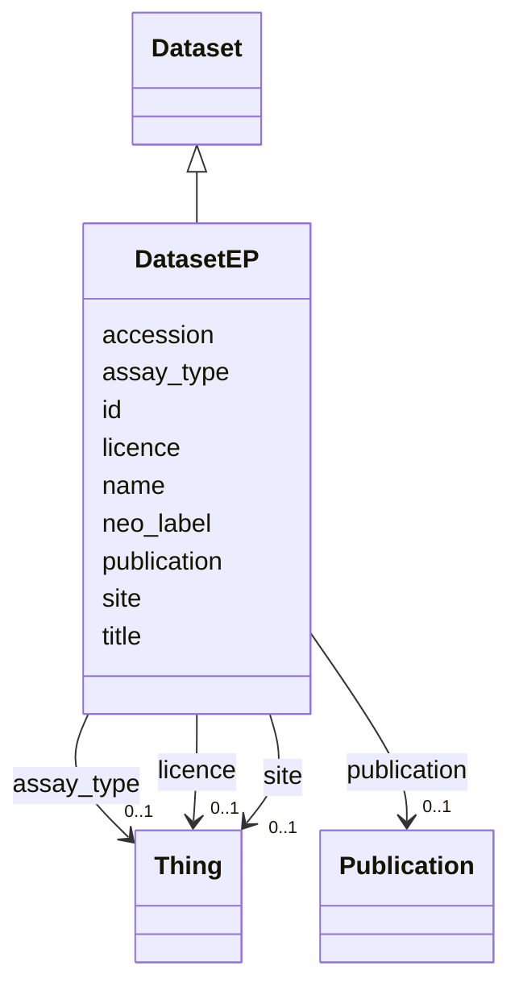

# Class: DatasetEP


_Avoids a keyerror from attempting to use Dataset class from VFB_scRNAseq_schema directly._


URI: [http://github.org/vfb/vfb-EPseq-ontology/VFB_EPseq/:DatasetEP](http://github.org/vfb/vfb-EPseq-ontology/VFB_EPseq/:DatasetEP)





## Inheritance
* [Thing](Thing.md)
    * [Class](Class.md)
        * [Dataset](Dataset.md)
            * **DatasetEP**


## Slots

| Name | Cardinality and Range | Description | Inheritance |
| ---  | --- | --- | --- |
| [neo_label](neo_label.md) | 0..1 <br/> [String](String.md) | neo4j node label to add to entity | [Dataset](Dataset.md) |
| [publication](publication.md) | 0..1 <br/> [Publication](Publication.md) | Publication associated with the Dataset | [Dataset](Dataset.md) |
| [licence](licence.md) | 0..1 <br/> [Thing](Thing.md) | Licence for the Dataset (all CC-BY 4 | [Dataset](Dataset.md) |
| [assay_type](assay_type.md) | 0..1 <br/> [Thing](Thing.md) | Assay type (FBcv ID) for the Dataset, this will probably be 'FBcv:0009000' ('... | [Dataset](Dataset.md) |
| [site](site.md) | 0..1 <br/> [Thing](Thing.md) | VFB site node curie | [Dataset](Dataset.md) |
| [accession](accession.md) | 0..1 <br/> [String](String.md) | Accession of the Dataset at the given Site | [Dataset](Dataset.md) |
| [name](name.md) | 0..1 _recommended_ <br/> [String](String.md) | Short systematic label for the entity | [Class](Class.md) |
| [title](title.md) | 0..1 _recommended_ <br/> [String](String.md) | Short description of the entity | [Class](Class.md) |
| [id](id.md) | 1 <br/> [Uriorcurie](Uriorcurie.md) | Identifier for the entity | [Thing](Thing.md) |


## Identifier and Mapping Information


### Schema Source


* from schema: http://github.org/vfb/vfb-EPseq-ontology/VFB_EPseq


## Mappings

| Mapping Type | Mapped Value |
| ---  | ---  |
| self | http://github.org/vfb/vfb-EPseq-ontology/VFB_EPseq/:DatasetEP |
| native | http://github.org/vfb/vfb-EPseq-ontology/VFB_EPseq/:DatasetEP |


## LinkML Source

<!-- TODO: investigate https://stackoverflow.com/questions/37606292/how-to-create-tabbed-code-blocks-in-mkdocs-or-sphinx -->

### Direct

<details>
```yaml
name: DatasetEP
description: Avoids a keyerror from attempting to use Dataset class from VFB_scRNAseq_schema
  directly.
from_schema: http://github.org/vfb/vfb-EPseq-ontology/VFB_EPseq
is_a: Dataset

```
</details>

### Induced

<details>
```yaml
name: DatasetEP
description: Avoids a keyerror from attempting to use Dataset class from VFB_scRNAseq_schema
  directly.
from_schema: http://github.org/vfb/vfb-EPseq-ontology/VFB_EPseq
is_a: Dataset
attributes:
  neo_label:
    name: neo_label
    annotations:
      owl:
        tag: owl
        value: AnnotationProperty
    description: neo4j node label to add to entity.
    from_schema: http://github.org/vfb/vfb-EPseq-ontology/VFB_EPseq
    rank: 1000
    slot_uri: neo_property:nodeLabel
    alias: neo_label
    owner: DatasetEP
    domain_of:
    - Dataset
    - Sample
    - Assay
    - Cluster
    - Publication
    range: string
  publication:
    name: publication
    annotations:
      owl.fstring:
        tag: owl.fstring
        value: AnnotationAssertion( dcterms:references {id} {V} )
    description: Publication associated with the Dataset.
    from_schema: http://github.org/vfb/vfb-scRNAseq-ontology/VFB_scRNAseq
    rank: 1000
    slot_uri: dcterms:references
    alias: publication
    owner: DatasetEP
    domain_of:
    - Dataset
    range: Publication
  licence:
    name: licence
    annotations:
      owl.fstring:
        tag: owl.fstring
        value: AnnotationAssertion( dcterms:licence {id} {V} )
    description: Licence for the Dataset (all CC-BY 4.0 for scExpressionAtlas).
    from_schema: http://github.org/vfb/vfb-scRNAseq-ontology/VFB_scRNAseq
    rank: 1000
    slot_uri: dcterms:licence
    alias: licence
    owner: DatasetEP
    domain_of:
    - Dataset
    range: Thing
  assay_type:
    name: assay_type
    annotations:
      owl.fstring:
        tag: owl.fstring
        value: ClassAssertion( ObjectSomeValuesFrom( OBI:0000312 {V} ) {id} )
    description: Assay type (FBcv ID) for the Dataset, this will probably be 'FBcv:0009000'
      ('single-cell RNA-seq').
    from_schema: http://github.org/vfb/vfb-scRNAseq-ontology/VFB_scRNAseq
    rank: 1000
    slot_uri: OBI:0000312
    alias: assay_type
    owner: DatasetEP
    domain_of:
    - Dataset
    range: Thing
  site:
    name: site
    annotations:
      owl.fstring:
        tag: owl.fstring
        value: AnnotationAssertion( Annotation( neo_custom:accession {accession} )
          oboInOwl:hasDbXref {id} {V} )
    description: VFB site node curie. The site must be created in VFB and added to
      the dictionary in ../scripts/process_site_data.py to successfully map from FB
      data.
    from_schema: http://github.org/vfb/vfb-scRNAseq-ontology/VFB_scRNAseq
    rank: 1000
    slot_uri: oboInOwl:hasDbXref
    alias: site
    owner: DatasetEP
    domain_of:
    - Dataset
    range: Thing
  accession:
    name: accession
    description: Accession of the Dataset at the given Site.
    from_schema: http://github.org/vfb/vfb-scRNAseq-ontology/VFB_scRNAseq
    rank: 1000
    slot_uri: neo_custom:accession
    alias: accession
    owner: DatasetEP
    domain_of:
    - Dataset
    range: string
  name:
    name: name
    annotations:
      owl:
        tag: owl
        value: AnnotationAssertion
    description: Short systematic label for the entity.
    from_schema: http://github.org/vfb/vfb-EPseq-ontology/VFB_EPseq
    rank: 1000
    slot_uri: rdfs:label
    alias: name
    owner: DatasetEP
    domain_of:
    - Class
    range: string
    recommended: true
  title:
    name: title
    annotations:
      owl:
        tag: owl
        value: AnnotationAssertion
    description: Short description of the entity.
    from_schema: http://github.org/vfb/vfb-EPseq-ontology/VFB_EPseq
    rank: 1000
    slot_uri: IAO:0000115
    alias: title
    owner: DatasetEP
    domain_of:
    - Class
    range: string
    recommended: true
  id:
    name: id
    description: Identifier for the entity. FlyBase identifiers should be prefixed
      with 'FlyBase:'.
    from_schema: http://github.org/vfb/vfb-EPseq-ontology/VFB_EPseq
    rank: 1000
    identifier: true
    alias: id
    owner: DatasetEP
    domain_of:
    - Thing
    range: uriorcurie
    required: true

```
</details>